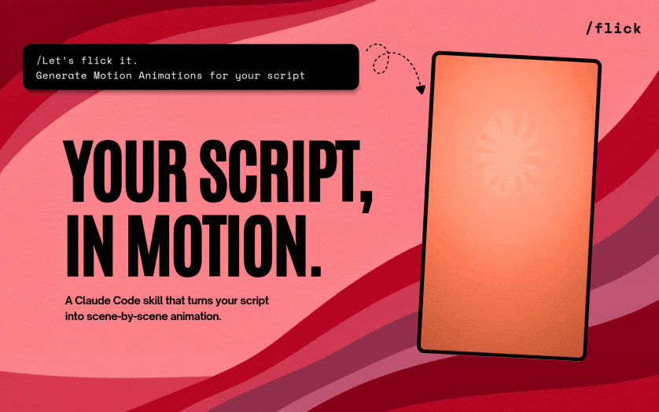

# Flick



Turn a video, link, or transcript into original short-form scene animations with an AI motion director.

> **This is a fork** of [Creatorberry/flick](https://github.com/Creatorberry/flick) (MIT), which builds every scene with Remotion. This fork adds **pluggable render engines**: each scene can be built with **Remotion** (React/frame animation), **HyperFrames** (HTML/CSS/GSAP), or **ai-clip** — real AI-generated footage via **MuAPI** (~96 models: Veo, Kling, Seedance, Runway, Wan…) or **HIGGSFIELD**. Upstream credit and license are preserved; see [LICENSE](LICENSE).

## What Flick does

```text
video or link → timestamped transcript
transcript → aspect ratio + brand assets + your opinion + default engine
approved scene plan → named scene animations (Remotion / HyperFrames / ai-clip)
preview → feedback → reusable scene animations
```

Flick creates a timestamped transcript from a video or public link. If you paste a transcript, that becomes the script Flick animates. It then asks only for your aspect ratio, selected brand assets, and creative opinion before it plans the scenes.

There is no background music. Flick uses bundled sound effects only when they match an on-screen action.

## Install

### Claude Code

```text
/plugin marketplace add issawilliams5-ux/flick
/plugin install flick@flick
```

Then run `/flick`.

### Updates

To receive Flick updates automatically, open `/plugin`, choose **Marketplaces**, select **flick**, and enable auto-update. Claude Code will check for updates when it starts; run `/reload-plugins` when it asks you to activate an update.

To update manually instead:

```text
/plugin update flick@flick
/reload-plugins
```

### Codex

```text
npx skills add issawilliams5-ux/flick --skill flick --agent codex --global --yes
```

Then ask: `Use $flick to animate this.`

Update later:

```text
npx skills update
```

### Other agent CLIs

For Grok Build, Gemini CLI, OpenCode, Cursor, Cline, and other compatible agents:

```text
npx skills add issawilliams5-ux/flick --skill flick --global
```

Follow the prompts to install Flick in your agent. To update it later:

```text
npx skills update -g
```

## First run

The first Flick run creates a local `flick-output/` workspace and installs:

- a bundled FFmpeg binary
- Whisper
- yt-dlp
- Flick's bundled sound effects
- then, once you've chosen an engine, only that engine's dependencies — Remotion (npm) for Remotion scenes, or nothing extra for HyperFrames (fetched on demand via `npx hyperframes`) and ai-clip

It needs Node.js 20+, Python 3, and network access. If Node or Python is missing, Flick tells you how to install it and asks before it runs a system installer.

**ai-clip credentials.** ai-clip scenes call a paid generation API and are the only engine that costs money per scene. MuAPI (the default provider) reads `MUAPI_KEY` from your environment; HIGGSFIELD runs through its MCP connector. Flick never writes either credential into your project, and never submits a billable generation without showing you the cost and asking first.

## The output

Each Flick run uses one local folder:

```text
flick-output/
  transcript.json
  flick-plan.md
  composition-brief.md
  scene-spec.json
  brand-assets/
  remotion/            (only if a scene uses the Remotion engine)
  hyperframes/          (only if a scene uses the HyperFrames engine)
  scenes/
    [approved-scene-name]/
      [approved-scene-name].mp4
      poster.jpg
      ai-clip-source.json   (ai-clip scenes only — provider, model, prompt)
```

`flick-plan.md` is the compact scene plan you approve. `composition-brief.md` and `scene-spec.json` are the build instructions — `scene-spec.json` carries each scene's `engine`, so one run can mix engines. Every engine writes its finished scene to the same `scenes/[name]/[name].mp4` path.

## Reusable animation library

Flick installs editable templates in [`skills/flick/saved-animations/`](skills/flick/saved-animations/) — Remotion components (`.tsx`) and HyperFrames compositions (`.html`). Before building, Flick reads that folder's catalog and reuses a template only when its visual pattern clearly fits the requested scene. ai-clip scenes are never saved there: they're one-off generations tied to a prompt, not templates.

## Screenshot or prompt to UI code (optional)

Two open-source tools are wired in on demand for scenes that have to show a real interface — an app screen, dashboard, terminal, or landing page. They turn a screenshot or a written description into HTML/Tailwind you adapt into a HyperFrames composition or a Remotion component. Neither is vendored here; both are cloned and installed outside the repo:

```text
node skills/ui-from-screenshot/scripts/setup-ui-tools.mjs --tool all
```

- **[screenshot-to-code](https://github.com/abi/screenshot-to-code)** (MIT) — screenshot in, markup out. Backend on port **7001**, Vite frontend on **5173**.
- **[OpenUI](https://github.com/wandb/openui)** (Apache-2.0) — describe an interface in words and iterate on it live. One process on port **7878**.

Both need a vision-capable LLM API key before they can generate anything; see [`.env.example`](.env.example) and [`skills/ui-from-screenshot/SKILL.md`](skills/ui-from-screenshot/SKILL.md) for the run commands, keys, and guardrails. They emit static pages — a starting layout to trim and animate, not a finished scene.

## Review and reuse

Flick renders each scene and opens its engine's preview surface — Remotion Studio for Remotion scenes, `npx hyperframes preview` for HyperFrames scenes — and asks what should change. An ai-clip scene has no live preview; the generated MP4 is the preview, and revising it means regenerating with an adjusted prompt (re-running the cost gate), not editing code. Flick revises only the scene you mention. Once you approve, Flick asks which scene animations you want saved as reusable assets.

## Start with the right source

Flick turns source material into motion animation. If you need to find source content or develop an idea first, [Creatorberry](https://www.creatorberry.com/?utm_source=github&utm_medium=opensource&utm_campaign=flick) helps you find what is viral, script it, and post it.

## Examples

See the [Flick examples gallery](examples/) for six animations made with Flick, including [China OCR hook](examples/china-ocr-hook/), [Claude token waste](examples/claude-token-waste/), and [Gstack workflow](examples/workflow-start-to-finish/).

## Privacy and source material

Use only video, images, fonts, audio, and brand assets that you have the right to use. Flick workspaces remain local and are ignored by default.

## Contributing

Flick welcomes showcase examples made with Flick. Creatorberry maintains the core skills, scripts, and workflow. See [CONTRIBUTING.md](CONTRIBUTING.md).

## License

MIT

---

Built by [Creatorberry](https://www.creatorberry.com/?utm_source=github&utm_medium=opensource&utm_campaign=flick).
